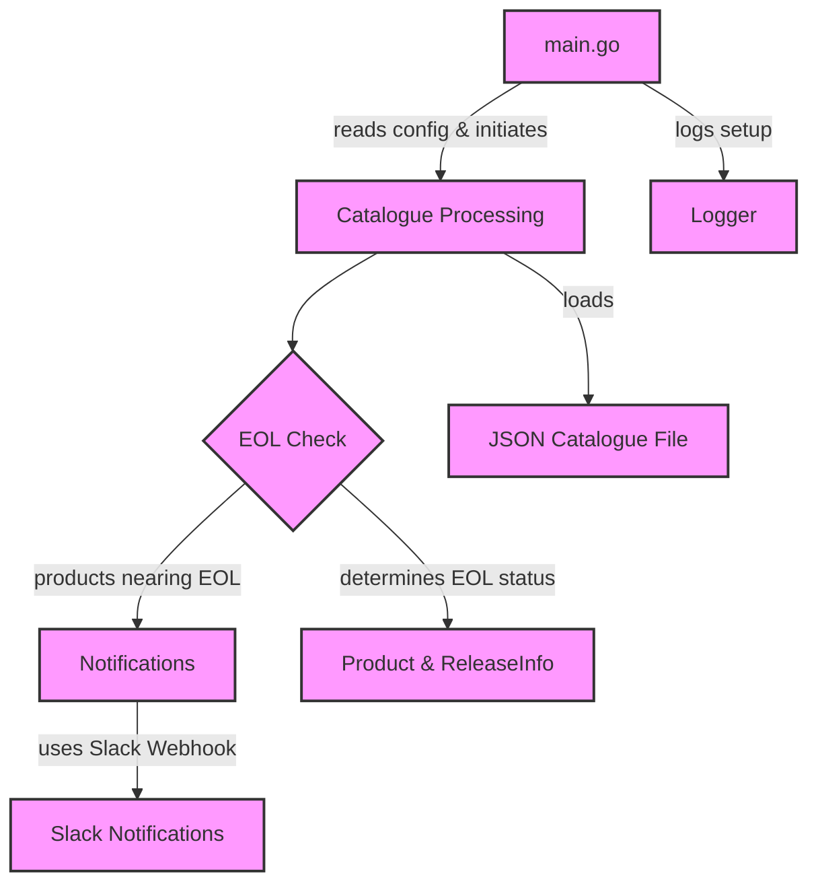

# EOL Scream

EOL Scream is a tool designed to notify users about products that are nearing their end-of-life (EOL) date. The tool fetches product information from a specified catalogue and checks if any products are within six months of reaching their EOL. If products nearing EOL are found, EOL Scream can notify users via Slack, enabling proactive measures to be taken ahead of the product's end-of-life.

## Features

- **Catalogue Processing:** Load product information from a JSON catalogue.
- **EOL Check:** Determine if any products are nearing their end-of-life within a six-month threshold.
- **Notifications:** Send notifications to a Slack channel using a webhook URL when products nearing their EOL are found.

## How It Works

EOL Scream operates by reading product information from a specified JSON file containing a list of products and their EOL dates. It then checks if any of the products are within six months of their EOL date. If such products are found, it uses Slack's webhook functionality to send notifications.

## Application Code Flow

The following diagram illustrates the flow of the application code in Go, highlighting how the main components interact within the system:



## Configuration

The tool can be configured through environment variables:
- `SLACK_WEBHOOK_URL`: The Slack webhook URL for sending notifications (mandatory).
- `CATALOGUE_FILE`: The path to the JSON file containing the product catalogue (default: `catalogue.json`).
- `LOG_LEVEL`: The log level for the application's output (default: `INFO`).

## Setup

### Prerequisites

- Go 1.22 or later
- Docker (optional, for containerization)

### Building and Running

1. **Clone the repository:**

```sh
git clone https://github.com/BennyC/eolscream
cd eolscream
